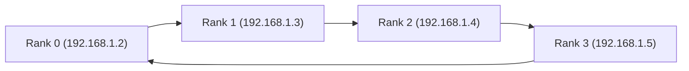

# prima.cpp: Speeding up 70B-level LLM inference on low-resource everyday home clusters


[](https://opensource.org/licenses/MIT)

prima.cpp is a **distributed implementation** of [llama.cpp](https://github.com/ggerganov/llama.cpp) that lets you **run 70B-level LLMs on your everyday devices**—💻 laptops, 🖥️ desktops, 📱 phones, and tablets (GPU or no GPU, it’s all good). With it, you can run **QwQ-32B, Qwen 2.5-72B, Llama 3-70B, or DeepSeek R1 70B** right from your local home cluster!

Worried about OOM or your device stucking? Never again! prima.cpp keeps its **memory pressure below 10%**, you can run very large models while enjoying Tiktok (if you don't mind the inference speed).

## 🚀 Performance
How about speed? Built upon llama.cpp, but it’s **15x faster!** 🚀 On my poor devices, QwQ-32B generates 11 tokens per second, and Llama 3-70B generates 1.5 tokens per second. That's about the same speed as audiobook apps, from slow to fast speaking. We plan to power a **Home Siri** soon, then we can have private chats without privacy concerns.

**prima.cpp vs llama.cpp on QwQ 32B:**

https://github.com/user-attachments/assets/9fa3e57f-3f6b-49f3-800e-df9d758a60c6

**prima.cpp vs llama.cpp on DeepSeek R1 70B:**

https://github.com/user-attachments/assets/9549290e-a56f-46e1-9549-74250c1e0f7e

And, if your devices are more powerful, you could unlock even more possibilities, like running LLM agents right in your home! If you do, we’d love to hear about it, just share your cluster setup and token throughput with us!

**Table 1:** Home cluster configurations.
|          | D1              | D2       | D3        | D4                    |
|----------|-----------------|----------|-----------|------------------------|
| Device   | Mac M1          | Laptop   | Desktop   | Mate40Pro              |
| OS       | MacOS (UMA)     | Linux    | Linux     | Linux (on HarmonyOS)   |
| CPU      | Apple M1        | Intel i9 | Intel i9  | Kirin 9000             |
| CPU Cores| 8               | 8        | 16        | 8                      |
| RAM (available) | 2.4 GiB | 4.1 GiB  | 9.7 GiB   | 1.9 GiB                |
| Disk Read Speed | 0.72 GB/s | 2.98 GB/s | 3.17 GB/s | 1.37 GB/s              |
| GPU Type | Apple Metal     | 3070     | 2080TI    | -                      |
| VRAM (available) | -   | 8 GiB    | 11 GiB    | -                      |

> Device D4 runs inside a Termux-simulated Linux. Device D1 reads disk data in random mode and D2~D4 read in sequential mode.

**Table 2:** Token latency for Llama models.
| **Model**      | **llama.cpp** | **exo**   | **dllama** | **prima.cpp** |
|-----------------|---------------|-----------|------------|---------------|
| Llama 3-8B     | **15 ms**     | 263 ms    | 459 ms     | 54 ms         |
| Llama 3-14B    | **20 ms**     | -         | -          | 65 ms         |
| Llama 1-30B    | 202 ms        | -         | -          | **72 ms**     |
| Llama 3-45B    | 328 ms        | -         | -          | **233 ms**    |
| Llama 3-60B    | 7965 ms       | -         | -          | **468 ms**    |
| Llama 1-65B    | 8807 ms       | -         | -          | **569 ms**    |
| Llama 3-70B    | 10120 ms      | OOM       | OOM        | **674 ms**    |

**Table 3:** Token latency for Qwen 2.5, QwQ, and DeepSeek R1 models.

| **Model**                        | **llama.cpp** | **exo**       | **dllama** | **prima.cpp** |
|-----------------------------------|---------------|---------------|------------|---------------|
| Qwen-2.5-7B                      | **14 ms**     | 86 ms         | -          | 44 ms         |
| DeepSeek-R1-Distill-Qwen-7B      | **14 ms**     | 68 ms       | -          | 52 ms         |
| DeepSeek-R1-Distill-Llama-8B     | **14 ms**     | 77 ms       | 435 ms     | 59 ms         |
| Qwen-2.5-14B                     | **23 ms**     | 31710 ms  | -          | 65 ms         |
| DeepSeek-R1-Distill-Qwen-14B     | **24 ms**     | 23475 ms  | -          | 76 ms         |
| Qwen-2.5-32B and QwQ-32B         | 224 ms        | OOM           | -          | **89 ms**     |
| DeepSeek-R1-Distill-Qwen-32B     | 232 ms        | OOM           | -          | **93 ms**     |
| DeepSeek-R1-Distill-Llama-70B    | 10978 ms      | OOM           | -          | **724 ms**    |
| Qwen-2.5-72B                     | 12227 ms      | OOM           | -          | **867 ms**    |

> As video recording consumes some RAM, prima.cpp proactively reduces memory usage, resulting in slightly higher latency in the video compared to the table.

> In current implementation, each device is assigned at least one model layer. For example, this leads to a 1:1:29:1 split for Llama 3-8B, which makes prima.cpp less efficient. In future updates, we will have a 0:0:32:0 split and idle devices removed, then llama.cpp would become a special case of prima.cpp when serving small models.

## 🔑 Key Features

- **Run larger models with low memory pressure:** Use mmap to lazily load model weights, and the OS would free page cache on demand, then you can run models of any size with a low memory pressure.
- **Faster speed on small-scale, heterogeneous and cheap home clusters:** 
- - **GPU & CPU Offloading:** If a device has a GPU, you can use both GPU and CPU for inference. For example, when VRAM is full, we can offload some model layers to RAM.
- - **Piped-ring parallelism with prefetching:** Prefetch upcoming layer weights to overlap disk loading latency and use advanced piped-ring parallelism to prevent the "prefetch-release" effect. This new parallelism improves pipeline parallelism by using a ring structure and allows devices to run multiple cycles to predict a new token.
- - **Heterogeneity-aware workload distribution:** A scheduler is designed to optimize workload distribution based on each device's computing power, disk speed, memory, and OS (the OS will affect the disk speed and the memory management strategy). It decides how many model layers a device should handle and how many should run on GPU (if available). 
- - **Quantization:** We now support Q4K and IQ1 quantization (GGUF format) and are exploring a Q4K-IQ1 hybrid for a better balance between performance and speed.
- **Support Models:** We now support hot models like the **Llama, Qwen (and QwQ), and DeepSeek series**. More will be added in future updates.
- **Cross-Platform:** The cluster can consist of devices with different OSs, including macOS, Linux, Android, HarmonyOS, etc. Now, Android and HarmonyOS devices require Termux, and Windows support will be added in future update.

## ✅ Supported Models
Here are the models we have tested so far. You can also try more on Hugging Face!

### Llama
- **Llama 3-8B:** [Meta-Llama-3-8B-Instruct-Q4_K_M.gguf](https://huggingface.co/bartowski/Meta-Llama-3-8B-Instruct-GGUF)
- **Llama 3-14B:** [Llama-3-14B-Instruct-v1-Q4_K_M.gguf](https://huggingface.co/RDson/Llama-3-14B-Instruct-v1-GGUF)
- **Llama 1-30B:** [upstage-llama-30b-instruct-2048.Q4_K_S.gguf](https://huggingface.co/TheBloke/upstage-llama-30b-instruct-2048-GGUF)
- **Llama 3-45B:** [Llama-3-pruned-45B-Drobeta-Turnu-Severin-Q4_K_S.gguf](https://huggingface.co/Mihaiii/Llama-3-pruned-45B-Drobeta-Turnu-Severin)
- **Llama 3-60B:** [nyun-llama3-60B.Q4_K_S.gguf](https://huggingface.co/mradermacher/nyun-llama3-60B-GGUF)
- **Llama 1-65B:** [llama-65b.Q4_K_S.gguf](https://huggingface.co/TheBloke/LLaMA-65B-GGUF)
- **Llama 3-70B:** [Meta-Llama-3-70B-Instruct-Q4_K_S.gguf](https://huggingface.co/bartowski/Meta-Llama-3-70B-Instruct-GGUF)

### Qwen 2.5 / QwQ
- **Qwen 2.5-7B:** [Qwen2.5-7B-Instruct-Q4_K_M.gguf](https://huggingface.co/Qwen/Qwen2.5-7B-Instruct-GGUF)
- **Qwen 2.5-14B:** [Qwen2.5-14B-Instruct-Q4_K_M.gguf](https://huggingface.co/Qwen/Qwen2.5-14B-Instruct-GGUF)
- **Qwen 2.5-32B:** [Qwen2.5-32B-Instruct-Q4_K_M.gguf](https://huggingface.co/Qwen/Qwen2.5-32B-Instruct-GGUF)
- **Qwen 2.5-72B:** [Qwen2.5-72B-Instruct-Q4_K_M.gguf](https://huggingface.co/Qwen/Qwen2.5-72B-Instruct-GGUF)
- **QwQ-32B:** [qwq-32b-q4_k_m.gguf](https://huggingface.co/Qwen/QwQ-32B-GGUF)

### DeepSeek
- **DeepSeek R1-7B:** [deepseek-ai.DeepSeek-R1-Distill-Qwen-7B.Q4_K_M.gguf](https://huggingface.co/DevQuasar/deepseek-ai.DeepSeek-R1-Distill-Qwen-7B-GGUF)
- **DeepSeek R1-8B:** [deepseek-ai.DeepSeek-R1-Distill-Llama-8B.Q4_K_M.gguf](https://huggingface.co/DevQuasar/deepseek-ai.DeepSeek-R1-Distill-Llama-8B-GGUF)
- **DeepSeek R1-14B:** [deepseek-ai.DeepSeek-R1-Distill-Qwen-14B.Q4_K_M.gguf](https://huggingface.co/DevQuasar/deepseek-ai.DeepSeek-R1-Distill-Qwen-14B-GGUF)
- **DeepSeek R1-32B:** [deepseek-ai.DeepSeek-R1-Distill-Qwen-32B.Q4_K_M.gguf](https://huggingface.co/DevQuasar/deepseek-ai.DeepSeek-R1-Distill-Qwen-32B-GGUF)
- **DeepSeek R1-70B:** [DeepSeek-R1-Distill-Llama-70B-Q4_K_M.gguf](https://huggingface.co/unsloth/DeepSeek-R1-Distill-Llama-70B-GGUF)

## ⚙️ How to Use?

### Prerequisites

Before using this project, ensure you have the following dependencies installed:

- gcc >= 9.4.0
- make >= 4.2.1
- cmake >= 3.16.3
- fio >= 3.16 (used for disk speed test)
- zmq >= 4.3.2 (used for cross-device communication)
- HiGHS >= 1.9.0 (used for automatic workload distribution)
- CUDA (optional, if you have a GPU)

**Linux (e.g., Ubuntu):**

```shell
sudo apt update -y && sudo apt install -y gcc-9 make cmake fio git wget libzmq3-dev
```

For HiGHS, download and install from [source](https://github.com/ERGO-Code/HiGHS):

```shell
git clone https://github.com/ERGO-Code/HiGHS.git
cd HiGHS
mkdir build && cd build
cmake ..
make -j$(nproc)
sudo make install
```

**macOS:**

```shell
brew install gcc make cmake fio git wget highs zeromq
```

### Build, Download, and Test

First, clone this repo and build the project:

```shell
cd prima.cpp

# If you are on the device with rank 0, USE_HIGHS=1 must be added:
make USE_HIGHS=1 -j$(nproc)

# If you have CUDA installed, add GGML_CUDA=1:
make GGML_CUDA=1 -j$(nproc)  

# For macOS with very large models, disable Metal might be better:
make LLAMA_NO_METAL=1 -j$(nproc)  

# To enable debug mode, add LLAMA_DEBUG=1:
make LLAMA_DEBUG=1 -j$(nproc) 

# Otherwise, just use:
make -j$(nproc) 
```

To test if it works, we download a GGUF model file from Hugging Face (e.g., [qwq-32b-q4_k_m.gguf](https://huggingface.co/Qwen/QwQ-32B-GGUF)):

```shell
mkdir download  # You can put it in any other path, but try to put it on an SSD if possible.
wget https://huggingface.co/Qwen/QwQ-32B-GGUF/resolve/main/qwq-32b-q4_k_m.gguf -P download/
```

> **Note:** Put this project and model files on SSD, if SSD and HDD coexist.

After downloading, run the following command to launch the inference task (if running on a single device, prima.cpp degrades to llama.cpp):

```shell
./llama-cli -m download/qwq-32b-q4_k_m.gguf -c 1024 -p "what is edge AI?" -n 256 -ngl 30
```

> Adjust `-ngl` according to your VRAM capacity. Here, the VRAM is 11 GiB, so setting `-ngl` to a maximum of 30 will not cause GPU to OOM. If there is no GPU, just ignore it. For other parameters, please refer to [llama.cpp](https://github.com/ggml-org/llama.cpp).

### Run on Multiple Devices
To run on more home devices, first connect them to the same local Wi-Fi. For example, assume we have 4 devices with IP addresses and ranks as follows:

- Rank 0: 192.168.1.2 (act as the head device, which initiates the request)
- Rank 1: 192.168.1.3 (worker device with 8 GiB VRAM)
- Rank 2: 192.168.1.4 (worker device with 11 GiB VRAM)
- Rank 3: 192.168.1.5 (worker device)

These devices communicate in a ring structure and they can run multiple rounds to predict one token.



> **NOTE:** This ring communication is a communication overlay, not the physical topology. These devices are physically fully connected because they all connect to the same Wi-Fi.

> If possible, disable the firewall to prevent the ports needed (e.g., 9000, 10000) been blocked.


Take QwQ-32B as an example, run the following commands on the devices to launch distributed inference:

```shell
# on head device without a GPU, rank 0:
./llama-cli -m download/qwq-32b-q4_k_m.gguf -c 1024 -n 256 -p "what is edge AI?" --world 4 --rank 0 --master 192.168.1.2 --next 192.168.1.3 --prefetch

# on worker device with 8 GiB VRAM, rank 1:
./llama-cli -m download/qwq-32b-q4_k_m.gguf -c 1024 --world 4 --rank 1 --master 192.168.1.2 --next 192.168.1.4 --prefetch --gpu-mem 8

# on worker device with 11 GiB VRAM, rank 2:
./llama-cli -m download/qwq-32b-q4_k_m.gguf -c 1024 --world 4 --rank 2 --master 192.168.1.2 --next 192.168.1.5 --prefetch --gpu-mem 11

# on worker device without a GPU, rank 3:
./llama-cli -m download/qwq-32b-q4_k_m.gguf -c 1024 --world 4 --rank 3 --master 192.168.1.2 --next 192.168.1.2 --prefetch
```

Once started, prima.cpp will profile each device and decide how much workload to assign, e.g., how many model layers each device should handle, and how many of them should run on GPU (if available).

### (Optional) Run with Prebuilt Docker Image
Assume we have a host machine with at least 32 CPU cores, 32 GiB RAM, and 32 GiB VRAM. We simulate 4 homogeneous nodes using Docker containers, with each node allocated 8 CPU cores, 8 GiB RAM, and 8 GiB VRAM. Follow the below steps to get started:

1. Pull our prebuilt Docker image (e.g., [`prima.cpp:1.0.0-cuda`](https://hub.docker.com/repository/docker/lizonghango00o1/prima.cpp/general)) and run 4 containers:

```shell
sudo docker run -dit --name prima-v1 --memory=8gb --memory-swap=8gb --cpus 8 --cpuset-cpus="0-7"   --network host --gpus all prima.cpp:1.0.0-cuda
sudo docker run -dit --name prima-v2 --memory=8gb --memory-swap=8gb --cpus 8 --cpuset-cpus="8-15"  --network host --gpus all prima.cpp:1.0.0-cuda
sudo docker run -dit --name prima-v3 --memory=8gb --memory-swap=8gb --cpus 8 --cpuset-cpus="16-23" --network host --gpus all prima.cpp:1.0.0-cuda
sudo docker run -dit --name prima-v4 --memory=8gb --memory-swap=8gb --cpus 8 --cpuset-cpus="24-31" --network host --gpus all prima.cpp:1.0.0-cuda
```

> If your host machine does not have a GPU, ignore the `--gpus all` option.

2. Download the model file [`qwq-32b-q4_k_m.gguf`](https://huggingface.co/Qwen/QwQ-32B-GGUF) and copy it into each container:

```shell
cd prima.cpp/download
sudo docker cp qwq-32b-q4_k_m.gguf prima-v1:/root/prima.cpp/download/
sudo docker cp qwq-32b-q4_k_m.gguf prima-v2:/root/prima.cpp/download/
sudo docker cp qwq-32b-q4_k_m.gguf prima-v3:/root/prima.cpp/download/
sudo docker cp qwq-32b-q4_k_m.gguf prima-v4:/root/prima.cpp/download/
```

3. (Optional) Enter each container, rebuild prima.cpp if your host machine does not have a GPU:

```shell
cd /root/prima.cpp && make clean
make -j$(nproc)  # If not rank 0
make USE_HIGHS=1 -j$(nproc)  # If rank 0
``` 

4. Enter each container and launch the distributed inference:

```shell
cd /root/prima.cpp
(prima-v1) ./llama-cli -m download/qwq-32b-q4_k_m.gguf -c 1024 -n 256 -p "what is edge AI?" --world 4 --rank 0 --prefetch --gpu-mem 8
(prima-v2) ./llama-cli -m download/qwq-32b-q4_k_m.gguf -c 1024 --world 4 --rank 1 --prefetch --gpu-mem 8
(prima-v3) ./llama-cli -m download/qwq-32b-q4_k_m.gguf -c 1024 --world 4 --rank 2 --prefetch --gpu-mem 8
(prima-v4) ./llama-cli -m download/qwq-32b-q4_k_m.gguf -c 1024 --world 4 --rank 3 --prefetch --gpu-mem 8
``` 

> If your host machine does not have a GPU, ignore the `--gpu-mem` option.

## ❓ FAQ

**1. How can I manually set the workload for each device?**

By default, prima.cpp automatically profiles devices and assigns workloads. However, if you want to manually control the layer distribution, you can use the `-lw` (or `--layer-window`, `--n-layer-window`) and `-ngl` options:

```shell
# on head device without a GPU, rank 0, use the option "-lw":
./llama-cli -m download/qwq-32b-q4_k_m.gguf -c 1024 -n 256 -p "what is edge AI?" --world 4 --rank 0 --master 192.168.1.2 --next 192.168.1.3 --prefetch -lw "16,16,16,16"

# on worker device with 8 GiB VRAM, rank 1, use the option "-ngl":
./llama-cli -m download/qwq-32b-q4_k_m.gguf -c 1024 --world 4 --rank 1 --master 192.168.1.2 --next 192.168.1.4 --prefetch -ngl 16

# on worker device with 11 GiB VRAM, rank 2, use the option "-ngl":
./llama-cli -m download/qwq-32b-q4_k_m.gguf -c 1024 --world 4 --rank 2 --master 192.168.1.2 --next 192.168.1.5 --prefetch -ngl 16

# on worker device without a GPU, rank 3:
./llama-cli -m download/qwq-32b-q4_k_m.gguf -c 1024 --world 4 --rank 3 --master 192.168.1.2 --next 192.168.1.2 --prefetch
```

- `-lw` sets the total model layers each device should handle. The format is a comma-separated list, one value per device, in rank order. You can also set `"8,8,8,8"`, `"4,4,4,4"`, `"16,16,24,8"`.
- `-ngl` sets how many of those model layers should run on the GPU. 

> Example: if `-lw "16,16,16,16"` is passed to the head device, then each of the 4 devices will handle 16 model layers. A worker with `-ngl 8` (if a GPU is available) will run 8/16 layers on the GPU.

**2. How to run in chat mode like in llama.cpp?**

To enable chat (conversation) mode, simply add the `-cnv` flag on the head device:

```shell
# on head device, rank 0, use the option "-cnv":
./llama-cli ... --rank 0 -p "You are an AI assistant" -cnv
```

To quit the chat mode, input `quit` or `exit`.

**3. How to force prefetching after computing?**

By default, prima.cpp only advises the OS to prefetch upcoming layer weights. The actual prefetching is then scheduled and handled by the OS, which may introduce some uncertainty. To explicitly trigger prefetching right after computing, you can use the `--force` flag on each device:

```shell
# on each device, use the option "--force":
./llama-cli ... --prefetch --force
```

This enables more aggressive overlap but also introduce extra memory access latency. Use `--force` only after testing, as its effect depends on your hardware and OS behavior.

**4. Does it support Windows?**

Not yet—but it's on the roadmap. Currently, prima.cpp can run on Linux, macOS, Android and HarmonyOS (via Termux). You can mix heterogeneous devices in the cluster.

## ❤️ Acknowledgment
This project builds upon the incredible work from the open-source community, especially [ggml, gguf](https://github.com/ggml-org/ggml), and [llama.cpp](https://github.com/ggml-org/llama.cpp). We gratefully acknowledge their contributions.

## 📚 Cite Us
If you find this work helpful, please do not hesitate to cite us and send a star! 🤩

```bibtex
@misc{li2025primacpp,
    title={PRIMA.CPP: Speeding Up 70B-Scale LLM Inference on Low-Resource Everyday Home Clusters}, 
    author={Zonghang Li and Tao Li and Wenjiao Feng and Mohsen Guizani and Hongfang Yu},
    year={2025},
    eprint={2504.08791},
    archivePrefix={arXiv},
    primaryClass={cs.DC},
    url={https://arxiv.org/abs/2504.08791}, 
}
```
